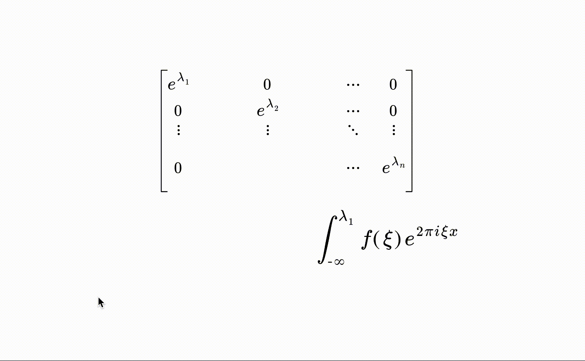

# latex_spring
latex parser and animation library for react!

# usage example:
In math_formula wirte the part of latex you want to animate in \anim<anim_id>{part of the formula you want to animate}
and add a Latex.Anim component as a child with the same anim_id you usesd in your formula (id={anim_id}).
Latex.Anim  is actually a svg group component and you can animate it with inline style ,using emotion, styled component or react-spring! 
If you preferet to use react-spring, you don't need to make a animated version of the component.It already gives you a <animated.g  style={spring}/> 

``` typescript 
import { css as emoCSS } from '@emotion/core'
import {useTheme} from  'emotion-theming'
import { useSpring, config } from '@react-spring/core'
import { Latex } from 'latex-spring'

export const Latex_ex: React.FC<> = () => {
    const theme = useTheme<Theme>()

    const [springs, set] = useSpring(() => ({
        transform: 'translate(0px,0px) scale(1) rotate(0deg)',
        transformOrigin: '0% -20%', 
        fill: theme.palette.gray.dark,
        config:config.wobbly
    }))

    useEffect(() => {
        set({ transform: 'translate(0px,0px) scale(1) rotate(0deg)' })
    }, [])
    return (
        <Latex
            style={{
                fill: 'black',
                position: 'relative',
                marginTop: 100,
                left: 300,
                zIndex: 1,
            }}
            svgHeight={600}
            svgWidth={900}
            font_size={1.6}
            className={'mathbox__svg'}
            math_formula={String.raw`
    \begin{bmatrix}
    e^{\lambda_1} & 0& \cdots & 0 \\
    0 & \anim<hover>{e^{\lambda_2}} & \cdots & 0 \\
    \vdots & \vdots & \ddots & \vdots \\ 
    0 & \anim<integral>{\int_{-\infty}^{\lambda_1} f(\xi) e^{2 \pi i \xi x}} & \cdots & e^{\lambda_n}
    \end{bmatrix} `}
        >
            <Latex.Anim
                id="hover"
                css={emoCSS({
                    transition: ' all .5s ease-in-out',
                    '&:hover': {
                        fill: 'red',
                        scale: '1.2',
                        cursor: 'pointer',
                        transition: ' all .5s ease-in-out',
                    },
                })}
            />
            <Latex.Anim 
            onClick={async()=>{ await set({transform:'translate(200px,100px) scale(1) rotate(0deg)'})
                            await set({transform:'translate(0px,0px) scale(2) rotate(0deg)',  config:config.molasses})
                            await Promise.all([set({transformOrigin:'-10%  10%' }),set({transform:'translate(0px,0px) scale(2) rotate(30deg)', config:config.default}) ]) 
                            await Promise.all([set({transformOrigin:'0%  0%' }),
                            set({transform:'translate(0px,0px) scale(1) rotate(0deg)', config:config.slow}) ]) 
                            await Promise.all([set({config:config.molasses, fill:theme.palette.orange.light}),
                            set({transform:'translate(0px,0px) scale(1.2) rotate(0deg)',  config:config.molasses})])
                        }}
                        
            id={'integral'}
            style={springs}
            />

        </Latex>
    )
}

```

